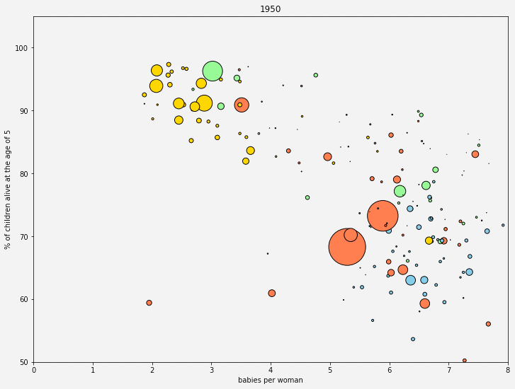

# Fertility and child mortality rates

## gapminder.org
[Gapminder](https://www.gapminder.org/) is an independent Swedish foundation with no political, religious or economic affiliations. This *fact tank* produces free resources, based on reliable statistics, promoting a *fact-based* worldview that everyone can understand.

  
   
    <em>Animation :)</em>

