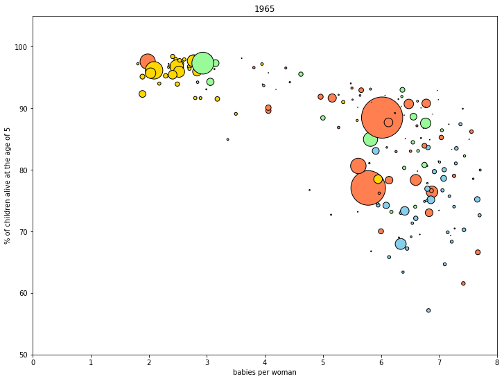

# Facts against drama: fertility and child mortality rates

## gapminder.org
[Gapminder](https://www.gapminder.org/) is an independent Swedish foundation with no political, religious or economic affiliations. This *fact tank* produces free resources, based on reliable statistics, promoting an easy-to-understand, *fact-based* worldview that is not overdramatic.

Statistics is the science of *learning from data* and of reducing *complex* structures and trends to *succinct* numerical descriptions and *powerful* visualisations. As such, it is an essential tool for understanding our complex world as it is.

## The dataset
For the following analysis, we use data curated by the above-mentioned organisation.
For all the countries in the world and for years starting in 1800, the dataset shows us basic facts about life in those countries: the population, the expected lifetime, the percentage of children surviving to the age of five, the average number of babies per woman, the gross domestic product (GDP) per capita – given in 2011 equivalent dollars – and the income available – on average – to each citizen each day.

## Survival and births
Following Gapminder, a point that we want to make is that the number of babies per woman (known as "fertility") depends strongly on child mortality: women have more children, when it is harder for them to survive. To see this, we plot the number of babies per woman and the percentage of children surviving to the age of five, selecting the data for the year, say, 1965.

  
   
    <em>Scatter plot for the year 1965; the colour map is described in the text and the dimension of the circles depends on the population of the specific country</em>

The dimension of the dots depends on the population of each country. Also, different colours designate different regions of the world: Africa is blue, Europe is gold, America is green and Asia is coral.
This plot shows very simply that, when children have hard times surviving, women have more babies.

## But the situation is getting better
We can go further, looking at the evolution of data from 1950 to 2015.

  
   
    <em>Scatter plot for a range of 65 years</em>

This plot now shows the world initially divided between a developed world – low child mortality and low natality – and a developing one – high child mortality and high natality. However, this distinction largely disappears as we approach our days: in 2015, most of the world has caught up with the developed countries, so to speak.

## Conclusions
This is a tremendous achievement for humanity, and it is nice to see it from just a few numbers.
We live in a globalised world, where more people than ever care about global development. The world has never been less bad, even though it is far from perfect.
